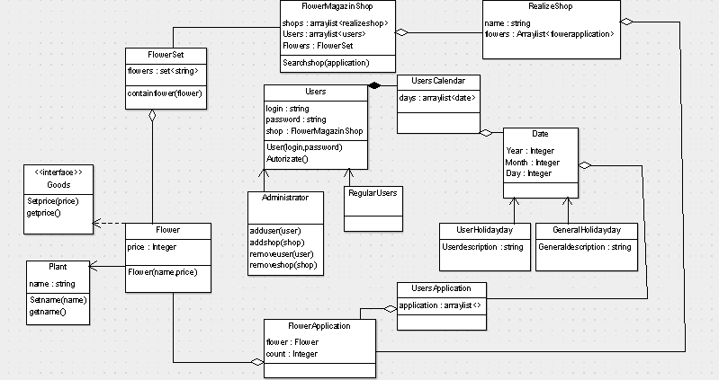

# Магазин квітів #
 
•	Дана програма дає можливість користувачу зареєструвати свою персональну сторінку, де він зможе зберігати календар своїх та загальних свят. 

•	Для кожної доданої дати користувач може вибрати квіти , які він буде замовляти або сам сформувати букет або вибрати уже готовий. 

•	Всією роботою керує адміністратор, у якого є доступ до даних кожного користувача. Він також може видалити користувача чи наприклад додати певні набори квітів. 

•	Якщо користувач хоче купити певний букет ,йому буде надано посилання на певні магазини. 

•	Також при описі кожної квітки чи букету буде надано його приблизну ціну.

# Uml diagram #

# Автори #
<LeraLeraChetveryk>
<anastasyashcherbak>
